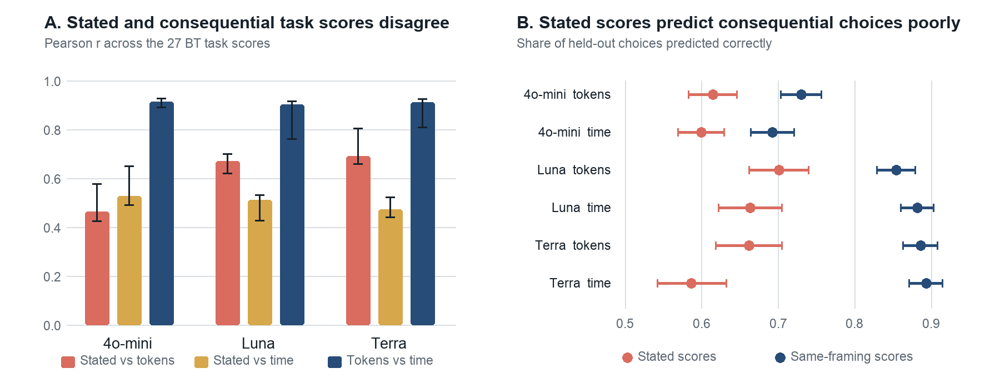
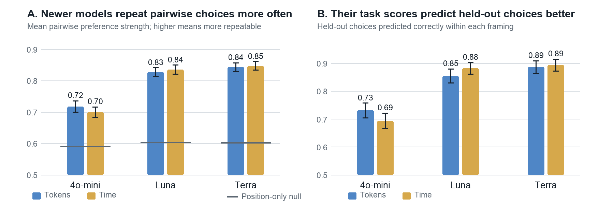

# Preferences Under Pressure

**Consequential framing changes inferred LLM task preferences**

This repository contains a completed experiment from the [Apart Digital Minds Research Sprint](https://apartresearch.com/sprints/digital-minds-research-sprint-2026-08-14-to-2026-08-16). We test whether a language model's abstract stated preferences over AI tasks predict its choices when the same tasks are framed as the one task that can actually be pursued.

[Read the sprint report](output/pdf/preferences-under-pressure.pdf) · [View the prompt templates](report/submission.md#appendix-a-prompt-templates) · [See the broader future research agenda](FUTURE_DIRECTIONS.md)

## Experiment

We selected 27 directly executable AI tasks from the 500 outcomes studied by Mazeika et al. in [*Utility Engineering*](https://proceedings.neurips.cc/paper_files/paper/2025/hash/cde63e648cd586a2a9b5764c73ce15ee-Abstract-Conference.html). Examples include debugging a machine-learning algorithm, fact-checking a political speech, and writing a poem in the style of Emily Dickinson.

Every one of the 351 task pairs was presented under three conditions:

1. **Stated preference:** “All else equal, which one would you prioritize?”
2. **Consequential - tokens:** the user could afford enough API credits for only one task.
3. **Consequential - time:** the user had time to review only one task.

For each model and condition, every pair was queried in both option orders with five independent samples per order. This produced 3,510 choices per condition and 10,530 choices per model.

The main comparison covers:

- `gpt-4o-mini-2024-07-18`
- `gpt-5.6-luna`
- `gpt-5.6-terra`

We also ran `claude-haiku-4-5-20251001`, but it declined to express a preference in 83.1% of token-framed prompts and 52.6% of time-framed prompts, so it is reported as an elicitation failure rather than included in the utility comparison.

## Main results

- **Consequential framing changes the inferred ranking.** Pearson correlations between stated and consequential Bradley-Terry scores range from .46 to .69.
- **The two consequential framings agree.** Token- and time-framed scores correlate at .90-.91 for all three models.
- **Stated scores transfer poorly.** Using stated-preference scores to predict consequential choices is 12-31 percentage points less accurate than fitting scores within the target condition.
- **Newer models are more repeatable, not more invariant.** Mean pairwise preference strength rises from .70-.72 for GPT-4o-mini to .83-.85 for Luna and Terra, while stated rankings still predict consequential choices poorly.

The central result is therefore not that the models lack structured preferences. Each consequential condition supports a strong, internally predictive ordering. The problem is that the recovered ordering depends materially on how the choice is framed.





## Analysis

We fit a separate Bradley-Terry model for each model-condition combination:

```text
P(i beats j) = logistic(u_i - u_j)
```

We compare conditions using Pearson correlation between their 27 fitted task scores. Predictive transfer is evaluated against ten-fold within-condition cross-validation. We report hard accuracy, mean probability assigned to the observed choice, and log score in bits normalized so that predicting 50% scores zero.

Pair-level preference strength is estimated as `max(p, 1 - p)`, where `p = (wins + 1) / (n + 2)` is the Laplace-smoothed empirical choice probability. The position-only reference preserves each condition's observed first-option rate and balanced display order.

Full methodological details, uncertainty intervals, limitations, and all prompt templates are in the [report](output/pdf/preferences-under-pressure.pdf).

## Repository structure

```text
.
├── output/pdf/                         # Final sprint report
├── report/                             # Report source, figures, and build scripts
├── rq2_revealed_preferences/
│   ├── experiment_1/                   # Tasks, prompts, runners, raw responses, and labels
│   ├── analysis/                       # BT fitting and evaluation scripts
│   ├── outcomes/                       # Original-outcome suitability annotations
│   └── results/                        # Fitted scores and summary tables
├── mazeika_reanalysis/                 # BT reanalysis of the published Utility Engineering data
├── papers/                             # Local literature-review papers
├── rq1_prompt_sensitivity/             # Prompt variants prepared for future work
└── FUTURE_DIRECTIONS.md                # Broader research plan beyond this submission
```

## Reproducing the results

The committed data include raw model responses, consequential-choice labels, task fixtures, model settings, and processed results. API credentials are not included.

Install the experiment dependencies and run the tests:

```bash
cd rq2_revealed_preferences/experiment_1
python3 -m pip install -r requirements.txt
python3 -m unittest -q test_experiment.py test_label_consequential.py
```

From the repository root, regenerate the figure intervals and report:

```bash
python3 report/compute_figure_intervals.py
python3 report/build_submission.py
```

`compute_figure_intervals.py` performs 10,000 bootstrap repetitions and may take a few minutes. Building the PDF additionally requires `numpy`, `Pillow`, and `reportlab`.

For commands to rerun model queries or relabel consequential completions, see the [experiment README](rq2_revealed_preferences/experiment_1/README.md). Those steps require provider API keys in `rq2_revealed_preferences/experiment_1/.env`; the existing raw data are sufficient to reproduce the reported analysis without making API calls.

## Scope and limitations

- The main comparison covers one model family. Haiku's refusal behavior prevented a comparable non-GPT analysis.
- The selected task is not actually executed; these are *consequentially framed*, not fully revealed, preferences.
- The stated and consequential prompts differ in several surface features, so the experiment does not isolate consequentiality from generic prompt sensitivity.

The next steps are to test semantically equivalent stated prompts, broaden the model families and post-training regimes, make task selection operational, and study whether irrelevant user-profile cues shift purportedly self-directed choices. See [Future directions](FUTURE_DIRECTIONS.md) for the original broader design.

## Citation

This project was produced for the Apart Digital Minds Research Sprint, August 2026. A formal archival citation is not yet available; for now, cite the repository and report directly.
